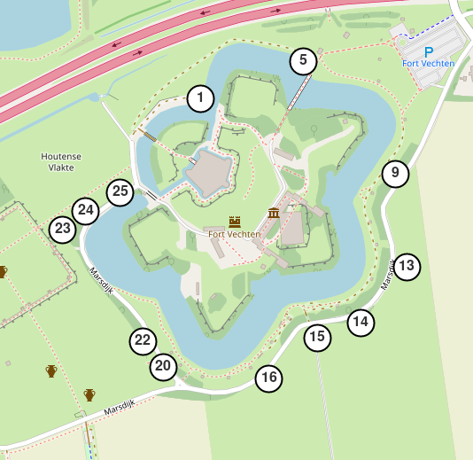

# RMD Observations
## Maps and Fotos Websites
https://rmdobservations.github.io/index.html
## Work in Progress
[comment]: <Needs to be in prackets> and not outside  

[comment]: <aim of project>  
# Table of contents
* Introduction
* Technologies
* Launch
* Illustrations
* Scope of functionalities
* Examples of use
* Project Status
* Sources
* Credits:
* Suggestions for README https://bulldogjob.com/news/449-how-to-write-a-good-readme-for-your-github-project

## Introduction
The central theme of these projects is displaying photographs and their location on a map.
Emphasis is made on small projects. No node.js stuff. 

## Technologies


## Launch


## Table of contents
* [limietpalen](https://rmdobservations.github.io/limietPalen_FortVechten/index.html)
* [Setup](#setup)

## General info
This project is simple Lorem ipsum dolor generator.
	
## Technologies
Project is created with:
* Lorem version: 12.3
* Ipsum version: 2.33
* Ament library version: 999
	
## Setup
To run this project, install it locally.:

```
$ cd ../lorem

# rmdobservations.github.io
when do I see this and when do I see index?
here aremy websites


